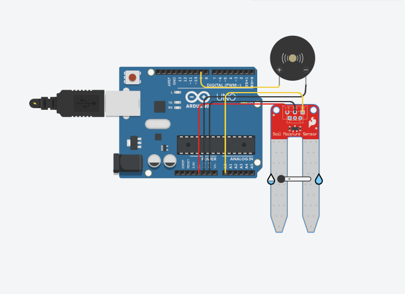
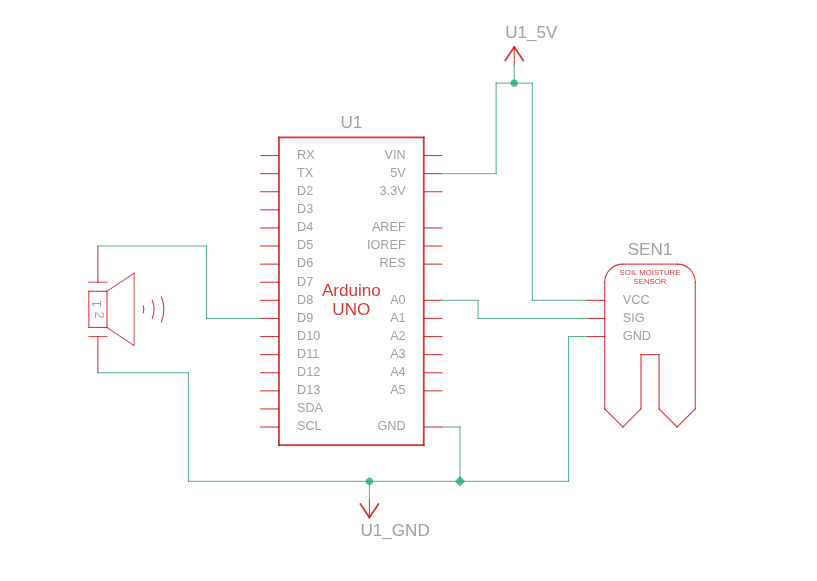
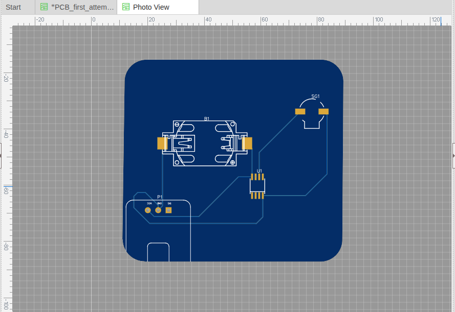

# Arduino Soil Moisture Sensor

A simple project to measure soil moisture using an Arduino and a soil moisture sensor. This project helps you alerrt you the water content of your plants and can be extended to automate watering.

## Features

- Real-time soil moisture monitoring
- buzzer alert if moisture down than 500
- Easy-to-build circuit

## Demo Setup



## Circuit Schema



## PCB Design



## Components Required

- Arduino Uno (or compatible)
- Soil Moisture Sensor
- Jumper wires
- Breadboard
- buzzer

## Wiring Instructions

1. Connect the VCC of the soil moisture sensor to 5V on Arduino.
2. Connect GND to GND.
3. Connect the analog output (A0) of the sensor to A0 on Arduino.

Refer to the Demo and schematic above for details.

## Example Arduino Code

```cpp
#define sensor A0
#define buzzer 9

int moisture = 0;

void setup()
{
  pinMode(sensor, INPUT);
  pinMode(buzzer, OUTPUT);
  Serial.begin(9600);
}

void loop()
{
  moisture = analogRead(sensor);
  Serial.println(moisture);
  if(moisture<500) tone(buzzer, 1000);
  else noTone(buzzer);
  delay(500);
}
```

## Usage

1. Assemble the circuit as shown.
2. Upload the code to your Arduino.
3. Open the Serial Monitor to view soil moisture readings.
---
